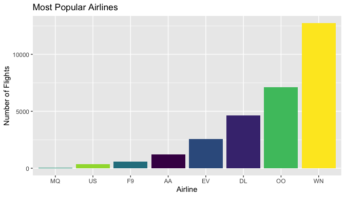
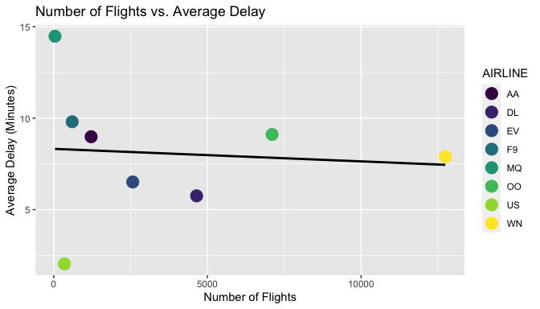
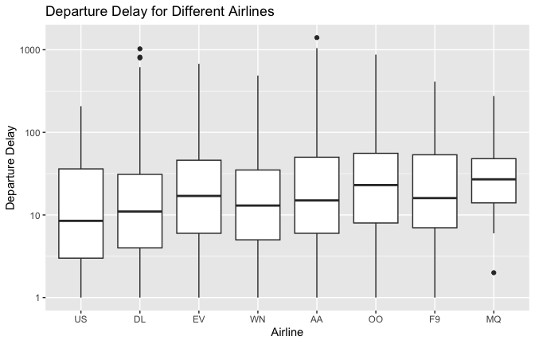
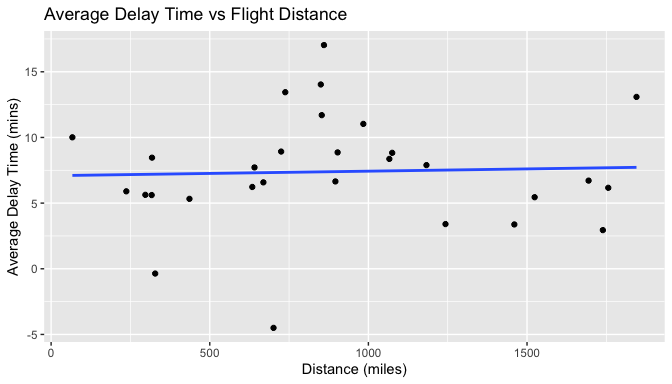

Milwaukee Airport Flight Delay Analysis
================

## Introduction

Airplanes are heavily utilized by millions of Americans as a source of
transportation for long distance travel. However, there are certain
instances where flights are unexpectedly delayed, causing passengers to
adjust their schedules at the last second. In this report, we examine
the data of flights in 2015 flying out of the Milwaukee Airport to
determine which airlines passengers should fly to best avoid the delays.
We also look to discover what other factors might cause flight delays,
including distance between airports and size of airports. An analysis of
flight delay trends across different airlines demonstrates that Delta
Airlines and US Airways are the two airlines with the least delays, and
discovered that neither day of the week nor distance has a large effect
on the number of delays.

## Background

Every year, the Department of Transportation’s (DOT) Bureau of
Statistics records the time performance of domestic flights throughout
the country in order to gather statistics regarding possible delays and
cancellations. The DOT accesses this data from U.S. airlines’ reports of
their flight data and compiles it into one dataset. We also incorporate
a secondary dataset published by the FAA in our research. This dataset
relates airport codes to the size of airports so we can draw conclusions
about flight delays based on the size of an airport.

The key independent variables that we will use to examine these
questions are the day of week of the flight, the airline identifier – a
two letter code assigned by the FAA that identifies airlines, and the
distance between the origin and destination airports, measured in miles.
The key dependent variable that we will use is the arrival delay, or the
difference between the actual arrival time and the scheduled arrival
time, measured in minutes.

#### List of Key Variables:

- “Airline” (Airline Code)
- “Departure_delay” (Minutes)
- “Origin_airport” (Airport Code)
- “Scheduled_arrival” (Minutes)
- “Scheduled_departure” (Time of Day)
- “Arrival_time” (Time of Day)
- “Distance” (Miles)
- “Day of Week”
- “Destination_airport”
- “Arrival_delay” (Minutes)

#### Airline Abbreviations:

- UA = United Airlines
- AA = American Airlines
- US = US Airways
- F9 = Frontier Airlines
- B6 = JetBlue Airways
- OO = Skywest Airlines
- AS = Alaska Airlines
- NK = Spirit Airlines
- WN = Southwest Airlines
- DL = Delta Airlines
- EV = Atlantic Southeast Airlines
- HA = Hawaiian Airlines
- MQ = Envoy Airlines
- VX = Virgin America

## Analysis

#### Question 1: What airline can you fly on to avoid the most delays?

This bar graph highlights the differences between the airlines and how
many flights they had in 2015 at the Milwaukee airport.

<!-- --><!-- -->

We can see that Southwest (WN) and Skywest (OO) are the most popular
airlines. Envoy (MQ), US Airways (US), and Frontier (F9) are the least
popular airlines. We need to consider how some of the airlines that have
significantly less flights than the more popular airlines when
interpreting our results and analyzing our data.

We then calculated the average departure delay and counted how many
flights there were in 2015 for each airline. We plotted this on a
scatter plot to see if there seemed to be any pattern.

<!-- --><!-- -->

We can’t conclude any relationship from this plot, but it seems like in
the first half of the graph there is a slight negative trend. This would
show that the airlines with lower number of flights have higher average
departure delays.

We created box plots for each airline to show the distribution of
departure delays. There is a log scale on the y axis to make the graph
more clear.

<!-- --><!-- -->

We see there are apparent differences in the departure delays between
airlines. Envoy Air (MQ) has the greatest departure delay median, while
US Airways (US) has the lowest median. American Airlines (AA) has the
greatest range in delay times and Envoy Air has the smallest range.
American Airlines, Delta (DL), and Envoy Air all have outliars.

We wanted to conduct two hypothesis tests to help us answer our question
about the best airline to fly with to avoid delays. Based on the above
graphs, we chose to look at US Airways and Delta as they have the lowest
median departure delays based on the box plot.

##### First Hypothesis Test:

For our hypothesis test, our population is flights leaving from
Milwaukee Airport in 2015 and our sample is the flights leaving from
Milwaukee in 2015. Our null hypothesis is that the true difference in
mean departure delay time for US airways is the same as the mean
departure delay time for all other airlines. Our alternative hypothesis
is that the true difference in mean departure delay time for US airways
is less than the mean departure delay time for all other airlines.

$$
\begin{gather*}
\text{Let }\bar{x} \text{ be the average departure delay} \\
H_0: \bar{x}_{\text{us}} = \bar{x}_{\text{not us}} \\
H_1: \bar{x}_{\text{us}} < \bar{x}_{\text{not us}}
\end{gather*}
$$

**Two Sample t-test**

|             |           |
|-------------|-----------|
| **T-Stat**  | -4.4095   |
| **P-Value** | 6.802e-06 |
| **Df**      | 369.68    |

Using t.test(), we found a p-value of 6.802e-06. This p value is very
low and almost zero illustrating how there is strong evidence against
the null hypothesis and in favor of the alternative hypothesis. This
highlights that the difference in the mean departure delay between US
Airlines and the other airlines is statistically significant.

##### Second Hypothesis Test:

For this hypothesis test, our null hypothesis is that the true
difference in mean departure delay time for DL airways is the same as
the mean departure delay time for all other airlines. Our alternative
hypothesis is that the true difference in mean departure delay time for
Delta airways is less than the mean departure delay time for all other
airlines. We chose not to use data from US airways because we wanted to
find the second best airline in terms of departure delay.

$$
\begin{gather*}
\text{Let }\bar{x} \text{ be the average departure delay} \\
H_0: \bar{x}_{\text{DL}} = \bar{x}_{\text{not DL}} \\
H_1: \bar{x}_{\text{DL}} < \bar{x}_{\text{not DL}}
\end{gather*}
$$

**Two Sample t-test**

|             |           |
|-------------|-----------|
| **T-Stat**  | -3.921    |
| **P-Value** | 4.453e-05 |
| **Df**      | 6566.7    |

Using t.test(), we found a p-value of 4.453e-05. This p value is very
low and almost zero illustrating how there is strong evidence against
the null hypothesis and in favor of the alternative hypothesis. This
highlights that the difference in the mean departure delay between Delta
Airlines (DL) and the other airlines is statistically significant.

#### Question 2: What might predict flight delays?

##### Distance

We considered distance as a factor for affecting flight delays. We made
a scatterplot between distance in miles and the departure delay for each
flight. We had to filter out some flights that had missing values, so
that’s why there aren’t many points.

<!-- --><!-- -->

Based on this graph and the best fit line, there doesn’t seem to be a
strong relationship between these two variables.

**Linear Model Generated w lm()**

|               |           |
|---------------|-----------|
| **Slope**     | 7.0873759 |
| **Intercept** | 0.0003447 |
| **P-value**   | 0.838798  |

$$
\begin{gather*}
\hat{y} =  7.0873759 + 0.0003447 \cdot x_0 \\
\end{gather*}
$$

We also calculated the linear model based on this data. We found that
the p-value is 0.838798, which means that there is not strong evidence
to conclude that the slope is non-zero. The model is average delay time
= distance \* .00344667 + 7.087374909. The correlation coefficient that
we calculated with cor() is .03949891. Since this is a very low r and
it’s close to 0, we can assume there is not a strong linear
relationship. There may be a nonlinear relationship.

##### Day of the Week

Another variable we considered to predict flight delays was the day of
the week. We plotted this with boxplots for each day of the week.

<!-- --><!-- -->

There doesn’t seem to be significant differences between the median days
of the week, but that may be because of the log scale of the y-axis.
Friday, Saturday, and Thursday seem to have the lowest median departure
delays. Monday and Tuesday have the highest median departure delays.
Saturday has the longest range with the highest maximum. Friday had the
lowest range with the lowest maximum.

## Discussion

Based on the general analysis of flight delays trends across different
airlines, the recommendation could be made that Delta Airlines and US
Airways are the two safest options for airlines to utilize when flying
out of Milwaukee. On average, these two airlines experienced the least
delays, both for the overall year of 2015, as well as across each day of
the week. We also can conclude that distance and day of the week don’t
seem to have a significant effect on delays and shouldn’t be considered
when comparing flights.

Some shortcomings of this analysis include the fact that some airlines
have significantly less flights than others and therefore there is less
data to analyze. For example, Envoy Air (MQ) is a regional airline,
operating feeder flights for American Airlines, and runs much fewer
flights than other larger airlines out of Milwaukee.

We may choose to analyze more recent data – for instance, US Airways was
bought out by American, who probably runs more flights as a result, and
therefore may suffer from different delays as a result. We may also
choose to analyze flights from a different airport; we chose to analyze
only flights from Milwaukee Airport to make the data file smaller and
more manageable instead of analyzing a 500 MB file.

After analyzing the trends of flight delays across different airlines,
we questioned whether these trends remain relevant in the present day.
Since this data was collected for the year of 2015, there is the
possibility that the efficiency of each airline might be altered years
later. However, we still hypothesize the conclusions that we have made
still remain accurate for present day air travel out of Milwaukee.

In summary, from the data that we analyzed, we conclude that Delta and
US Airways were the airlines who, on average, suffered the least delay
when flying out of Milwaukee.

## References

[^1]

[^2]

[^1]: <https://www.kaggle.com/datasets/usdot/flight-delays?select=airlines.csv>

[^2]: <https://www.faa.gov/airports/planning_capacity/npias/current/>
