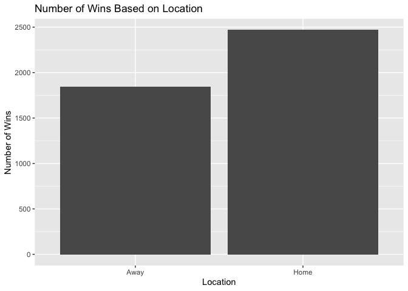
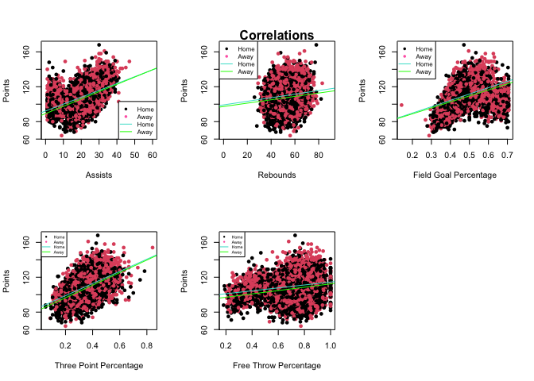
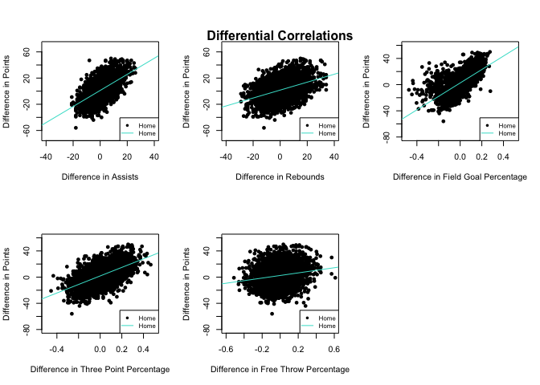

NBA Home Court Advantage Analysis
================
By Gavin Jimenez

------------------------------------------------------------------------

## Background

------------------------------------------------------------------------

Throughout all of sports, it is widely believed that home teams have an
advantage over visiting teams. Factors that lead to this advantage can
include the comfort of playing at home, rather than travelling, fans
creating an uplifting environment for the home team, and the referees
giving the home teams the benefit of the doubt when making decisions. In
this project, I will use games from the 2017 season to the 2021 season
to explore which statistics help increase the winning percentage of home
teams.

------------------------------------------------------------------------

<!-- --><!-- -->

------------------------------------------------------------------------

From this graph, it is clear that the home team tends to win more often
than the away team, at a rate of approximately 57.2%. Although this
helps demonstrate the existence and effectiveness of home court
advantage, I plan on looking more in depth on what statistics
specifically contribute to this advantage.

------------------------------------------------------------------------

## Variables Comparison

------------------------------------------------------------------------

When looking at the most common statistics recorded and referenced in
the game of basketball, the home team tends to have higher averages in
every category, with free throw percentage being approximately the same
regardless of being the home or away team.

------------------------------------------------------------------------

**Variable Averages**

| Variable               | Home      | Away      |
|------------------------|-----------|-----------|
| Points Scored per Game | 110.0619  | 107.3165  |
| Assists per Game       | 22.72457  | 21.60336  |
| Rebounds per Game      | 53.00736  | 51.70649  |
| Field Goal Percentage  | 0.4782582 | 0.4683032 |
| Three Point Percentage | 0.3609404 | 0.3506443 |
| Free Throw Percentage  | 0.7356284 | 0.7358135 |

------------------------------------------------------------------------

Comparing variables such as assists, rebounds, field goal percentage,
three point percentage, and free throw percentage to points scored
allows me to determine the levels of correlation between these variables
and overall scoring. As seen in the chart below, there appears to be a
relatively strong correlation between assists and points scored, as well
as field goal percentage and points scored. The highest correlation was
between three point percentage and scoring, which makes sense because
the three point shot is the highest valued shot in basketball. On the
other hand, free throw percentage had a low correlation with points
scored, as it is the lowest valued shot in the game. The lowest
correlated variable with scoring was rebounds, with a coefficient of
approximately 0.126.

------------------------------------------------------------------------

**Correlation Comparison**

| Comparison                            | Correlation Coefficient |
|---------------------------------------|-------------------------|
| Three Point Percentage, Points Scored | 0.4970947               |
| Assists, Points Scored                | 0.4624288               |
| Field Goal Percentage, Points Scored  | 0.4124854               |
| Free Throw Percentage, Points Scored  | 0.2104227               |
| Rebounds, Points Scored               | 0.1262783               |

------------------------------------------------------------------------

<!-- --><!-- -->

------------------------------------------------------------------------

## Variables Difference Comparison

------------------------------------------------------------------------

Although the correlation of the aforementioned variables to the amount
of points scored highlights the influence that each variable has on
scoring, this doesn’t directly demonstrate an influence on which team
wins the game. However, calculating the correlation between the
difference in each variable between the home and away team and the
difference in points scored between the home and away team offers a
better understanding on how each variable effects the outcome of the
game. Similar to the previous comparison, of the observed variables,
differences in rebounds and free throw percentages have less of a
correlation to the outcome of the game than other variables. Differences
in assists and three point percentages all had higher correlation
coefficients, which means teams that recorded more assists and shot
better from behind the arc tended to have higher positive point
differentials. The difference in field goal percentage had the strongest
correlation to the difference in points scored, with a coefficient of
approximately 0.651. This makes sense, as it logically makes sense that
the team that shoots the ball better overall will tend to have a higher
point differential against the opposing team.

------------------------------------------------------------------------

**Differential Correlation Comparison**

| Comparison                                                  | Correlation Coefficient |
|-------------------------------------------------------------|-------------------------|
| Difference in Field Goal Percentage, Difference in Points   | 0.6506938               |
| Difference in Three Points Percentage, Difference in Points | 0.5828377               |
| Difference in Assists, Difference in Points                 | 0.5678967               |
| Difference in Rebounds, Difference in Points                | 0.4300552               |
| Difference in Free Throw Percentage, Difference in Points   | 0.1948251               |

------------------------------------------------------------------------

<!-- --><!-- -->

------------------------------------------------------------------------

## Drawbacks and Shortcomings of my Analysis

------------------------------------------------------------------------

Although I utilized data from thousands of NBA games over several
seasons, one limitation of my analysis is that this is a relatively
small sample size compared to the entire history of the NBA. Increasing
the sample size of my data would provide more accurate analysis on which
variables effect home court advantage. Furthermore, another drawback of
my analysis was that a small percentage of the games that I used
occurred during the NBA bubble, in which games played between July 22,
2020 and October 11, 2020 were played behind closed doors due to the
COVID pandemic. Although there was the virtual presence of fans on large
monitors, the circumstances were not the same as the rest of the games
used. Despite teams being assigned home games, in which a majority of
the fans for the home team were displayed on the monitor, it is
difficult to analyze the effectiveness of playing at home due to the
differing circumstances.

------------------------------------------------------------------------

## Conclusion

------------------------------------------------------------------------

Based on the previously calculated correlations that depict both the
impact of each variable on not only scoring but the overall outcome of
the game, field goal percentage and three point percentage appear to be
the biggest factors contributing to home court advantage. I expected
this result because the modernization of the game has caused teams to
rely more heavily on shooting the ball at a more efficient rate. I
expected free throw percentage to contribute more to home court
advantage due to it being a scoring-related statistic, however, free
throws only being worth one point caused this variable to have less of
an effect that I thought. Rebounds having the least effect on home court
advantage does not surprise me, as this variable relates to defense more
than offense. Overall, I can conclude that shooting the ball more
efficiently than their opponent is the main reason why home teams tend
to win more often than away teams.

------------------------------------------------------------------------
